# Arquitetura — Escopo Completo do Nexo (nexus-orc-back)

Fonte: `.specify/memory/constitution.md` v1.2.0 e `specs/00{1,2,3,4,5,7,8,9}/plan.md`. Sem plan.md para 006. Escopo é exclusivamente backend (evidência: Additional Constraint "escopo exclusivamente backend").

## Diagrama de Arquitetura (Mermaid)

```mermaid
flowchart TB

subgraph CANAIS["Canais de Ingestão (4 fixos)"]
  direction LR
  C1["Portal Web"]
  C2["API REST"]
  C3["SFTP\n(AWS Transfer Family)"]
  C4["App Mobile"]
end

subgraph BUS["EventBridge custom bus 'nexo-dominio-bus'\n(Princípio II — único mecanismo de acoplamento entre BCs)"]
  EB{{" "}}
end

subgraph ING["BC Ingestão & Identificação — Fase 01 (spec 001)"]
  GW["Gateway de Ingestão\n(API Gateway + Lambda)"]
  MD1[["MarkItDown\n(conversão leve — texto p/ Classificador)"]]
  ACL1["ACL: BedrockClassificacaoACL\nMarkItDownConversaoACL"]
  S3RAW[("S3 nexo-orcamentos-raw\nversionado, deny-overwrite/delete\n(Princípio III — bruto imutável)")]
  AUR1[("Aurora Serverless v2\norcamentos / orcamentos_historico")]
end

subgraph EXTR["BC Extração — Fase 01 (spec 002)"]
  EXTU["Casos de uso Extração\n(ExtrairDadosOrcamento, RevisarExtracaoComIA...)"]
  MD2[["MarkItDown\n(conversão completa — estruturável p/ Extrator)"]]
  ACL2["ACL: BedrockExtracaoACL\nMarkItDownConversaoExtracaoACL"]
  AUR2[("Aurora Serverless v2\nextracoes_orcamento (JSONB itens/condicoes)")]
end

subgraph VAL["BC Validação — Fase 02 (spec 003)"]
  VALU["Casos de uso Validação\n(regras determinísticas: CNPJ, faixa preço, prazo)"]
  ACL3["ACL: OrcamentoExtraidoEventACL\nBedrockCategorizacaoACL / FornecedorCadastradoACL"]
  AUR3[("Aurora Serverless v2\nvalidacoes_orcamento + faixas_preco_categoria")]
  FORNEXT[/"Sistema externo: cadastro de fornecedores"/]
end

subgraph IDX["BC Busca & Indexação — Fase 02 (spec 004)"]
  IDXU["Casos de uso Indexação\n(gera embedding; busca híbrida SQL+vetor)"]
  ACL4["ACL: OrcamentoValidadoEventACL\nBedrockEmbeddingACL / BedrockInterpretacaoConsultaACL"]
  AUR4[("Aurora Serverless v2 + pgvector\nindices_orcamento (embedding HNSW)")]
end

subgraph ORQ["BC Orquestração — Fase 02 (spec 005)"]
  ORQU["Casos de uso Orquestração\n(consolida contexto de 001+002+003, decide workflow)"]
  AUR5[("Aurora Serverless v2\ndecisoes_workflow + read-model contexto_decisao_workflow")]
  ERPEXT[/"Sistema externo de compras da rede varejista\n(evento IntegracaoExternaSolicitada)"/]
end

subgraph ACOMP["BC Acompanhamento — Fase 03 (spec 007, escopo tático)"]
  ACOMPU["Read-model de auditoria\n(consome todos os eventos do bus)"]
  AUR6[("Aurora Serverless v2\nauditoria_trilha_eventos (append-only)")]
end

subgraph PLAT["Plataforma Transversal — Fase 03 (specs 007/008/009)"]
  TENANT["TenantId — Shared Kernel\n(único import direto autorizado entre BCs)"]
  RLS["PostgreSQL Row-Level Security\n(isolamento estrutural por tenant)"]
  CONF["Conformidade (LGPD)\nsrc/platform — orquestra esquecimento/retenção via evento"]
  CACHE[("DynamoDB\nnexo-cache-identificacao-fornecedor (TTL)")]
  LIFECYCLE["S3 Intelligent-Tiering\n(arquivamento sem perda de rastreabilidade)"]
end

subgraph BEDROCK["Amazon Bedrock Runtime — Agentes de IA (InvokeModel API, saída estruturada tool-use/JSON Schema)"]
  direction TB
  CLASS["Agente Classificador\n(papel fixo)"]
  EXTAG["Agente Extrator\n(papel fixo)"]
  CAT["Agente Categorizador de Item\n(auxiliar do papel Validador)"]
  EMB["Agente Gerador de Embeddings\n(Titan Text Embeddings V2 — papel fixo Indexação)"]
  QRY["Agente Interpretador de Consulta\n(capacidade do papel Indexação)"]
  ORQAG["Agente Orquestrador\n(papel fixo)"]
end

%% Canais -> Gateway
C1 & C2 & C3 & C4 --> GW

%% Ingestão
GW -->|"grava bruto"| S3RAW
GW --> AUR1
GW -->|"publica OrcamentoRecebido"| EB
EB -->|"consome OrcamentoRecebido (SQS classificador-queue)"| MD1
MD1 --> ACL1
ACL1 -->|"InvokeModel"| CLASS
CLASS -->|"resultado estruturado"| ACL1
ACL1 --> AUR1
ACL1 -->|"publica OrcamentoClassificado /\nOrcamentoEscalonadoParaRevisaoHumana"| EB

%% Extração
EB -->|"consome OrcamentoClassificado (SQS extrator-queue)"| MD2
S3RAW -.->|"leitura read-only (s3:GetObject)"| MD2
MD2 --> ACL2
ACL2 -->|"InvokeModel"| EXTAG
EXTAG --> ACL2
ACL2 --> AUR2
ACL2 -->|"publica OrcamentoExtraido /\nExtracaoEscalonadaParaRevisaoHumana /\nOrcamentoExtraidoComPendenciaConfirmada"| EB

%% Validação
EB -->|"consome OrcamentoExtraido"| ACL3
ACL3 -->|"InvokeModel (categorização p/ faixa de preço)"| CAT
CAT --> ACL3
ACL3 <-->|"consulta cadastro"| FORNEXT
ACL3 --> AUR3
ACL3 -->|"publica OrcamentoValidado /\nOrcamentoValidadoComRessalva /\nOrcamentoInconsistenciaDetectada"| EB

%% Busca & Indexação
EB -->|"consome OrcamentoValidado"| ACL4
ACL4 -->|"InvokeModel (embedding, assíncrono)"| EMB
EMB --> ACL4
ACL4 --> AUR4
ACL4 -->|"publica OrcamentoIndexado /\nFalhaIndexacaoDetectada"| EB
BUSCAAPI["POST /v1/orcamentos/busca\n(consumidor externo)"] -->|"consulta em linguagem natural"| QRY
QRY -->|"InvokeModel (síncrono)"| ACL4
ACL4 -->|"filtro SQL + similaridade pgvector"| AUR4

%% Orquestração (consolida 3 upstreams)
EB -->|"consome OrcamentoClassificado +\nOrcamentoExtraido + OrcamentoValidado"| ORQU
ORQU -->|"InvokeModel"| ORQAG
ORQAG --> ORQU
ORQU --> AUR5
ORQU -->|"publica OrcamentoAprovadoParaProcessamento /\nOrcamentoEncaminhadoParaComprador /\nOrcamentoReenvioSolicitado /\nIntegracaoExternaSolicitada"| EB
EB -->|"IntegracaoExternaSolicitada"| ERPEXT

%% Acompanhamento consome tudo
EB -->|"consome TODOS os eventos de domínio\n(Princípio I — rastreabilidade)"| ACOMPU
ACOMPU --> AUR6

%% Plataforma transversal
TENANT -.->|"Shared Kernel — import direto autorizado"| ING & EXTR & VAL & IDX & ORQ & ACOMP
RLS --- AUR1 & AUR2 & AUR3 & AUR4 & AUR5 & AUR6
CONF <-->|"SolicitacaoEsquecimentoRegistrada /\nDadoPessoalAnonimizadoNoContexto"| EB
CACHE <-->|"consulta/escrita sinal de fornecedor\n(nunca substitui decisão do agente)"| ACL1
LIFECYCLE --- S3RAW
```

## Legenda das integrações Core ↔ Bedrock Runtime

Todo agente roda dentro do **Amazon Bedrock Runtime**, invocado via `@aws-sdk/client-bedrock-runtime` (`InvokeModel`/tool-use), sempre atrás de uma **Anti-Corruption Layer (ACL)** própria do Bounded Context chamador — nunca o JSON/texto bruto do modelo cruza para o Domain. Isso é decisão explícita e repetida em toda spec (001–005), reforçando o Princípio V (IA generativa como motor de entendimento) e o risco de prompt injection via documento de fornecedor (mitigado por saída estruturada JSON Schema/tool-use, nunca texto livre interpretado como comando).

| Origem (core) | Agente (Bedrock Runtime) | Disparo | Saída consumida pelo core |
|---|---|---|---|
| BC Ingestão, `ClassificarOrcamento` | Agente Classificador | evento `OrcamentoRecebido` (SQS) | `ResultadoClassificacao` (fornecedor, formato, confiança) via `BedrockClassificacaoACL`; < 80% escala direto para revisão humana |
| BC Extração, `ExtrairDadosOrcamento` | Agente Extrator | evento `OrcamentoClassificado` (SQS) | itens/condições estruturados via `BedrockExtracaoACL`, nunca inventa valor (`CampoExtraido<T>`); campo sem confiança escala direto para revisão humana |
| BC Validação, avaliação de regras | Agente Categorizador de Item | item sem categoria explícita, para seleção de faixa de preço | categoria semântica via `BedrockCategorizacaoACL` (nunca decide consistência, só categoriza) |
| BC Busca & Indexação, `IndexarOrcamento` | Agente Gerador de Embeddings (Titan Text Embeddings V2) | evento `OrcamentoValidado`/`ComRessalva` (assíncrono) | vetor de embedding via `BedrockEmbeddingACL`, persistido em `pgvector` |
| BC Busca & Indexação, endpoint de busca | Agente Interpretador de Consulta | requisição síncrona `POST /v1/orcamentos/busca` | critérios estruturados + vetor de consulta via `BedrockInterpretacaoConsultaACL` |
| BC Orquestração, decisão de workflow | Agente Orquestrador | contexto consolidado (Ingestão+Extração+Validação) completo | decisão (aprovar/encaminhar/reenviar) + `criterio` auditável; confiança insuficiente escala direto ao comprador |

Todas as chamadas ao Bedrock são síncronas dentro do handler Lambda do consumidor (exceto a geração de embedding, que é assíncrona/fora do caminho crítico de UI), sujeitas a cold start — mesma consideração de design repetida em todas as specs; Provisioned Concurrency é decisão a medir, não assumida a priori.

## O que o diagrama cobre

- **6 Bounded Contexts** do Context Map: Ingestão & Identificação (001), Extração (002), Validação (003), Busca & Indexação (004), Orquestração (005), Acompanhamento (007, escopo tático de auditoria).
- **4 canais de ingestão fixos** convergindo para o Gateway único (Princípio "gateway único").
- **6 pontos de invocação Bedrock Runtime** (Classificador, Extrator, Categorizador de Item, Gerador de Embeddings, Interpretador de Consulta, Orquestrador), cada um com sua ACL — é o requisito explícito do pedido (integrações core ↔ Bedrock). Não há agentes revisores de IA: baixa confiança de qualquer papel fixo escala diretamente para revisão humana.
- **EventBridge `nexo-dominio-bus`** como único mecanismo de acoplamento entre BCs (Princípio II, NON-NEGOTIABLE) — nenhuma seta de chamada direta entre implementações internas de BCs distintos.
- **Persistência**: S3 `nexo-orcamentos-raw` (bruto imutável, Princípio III) + Aurora Serverless v2 Postgres por BC (schema próprio cada um, nunca compartilhado), com `pgvector` na Indexação.
- **Plataforma transversal (Fase 03)**: `TenantId` Shared Kernel + Row-Level Security (spec 007), Conformidade LGPD (spec 008), cache de identificação DynamoDB + S3 Intelligent-Tiering (spec 009).
- **Integrações externas**: cadastro de fornecedores (consultado pela Validação) e sistema de compras da rede varejista (consumidor de `IntegracaoExternaSolicitada`, publicado pela Orquestração).

## Notas de fidelidade à evidência

- Não existe `plan.md` para a spec 006 (Portal do Gestor MVP) no repositório — não representado no diagrama por ausência de artefato de arquitetura (a constituição também determina que UI é fora do escopo deste time).
- MarkItDown roda em **instância própria por Bounded Context** (ADR-002 da spec 002), nunca como serviço centralizado — refletido como dois blocos distintos (`MD1` leve, `MD2` completo).
- Os Agentes Revisores de IA (Classificação/Extração/Workflow) foram **removidos** das specs 001, 002 e 005 por decisão de produto — o padrão agora é papel fixo → escalonamento humano direto, sem um segundo agente de IA (ver Notas de revisão v5 da 001, ADR-003 da 002, ADR-002 da 005).
- Nenhum Bounded Context implementa Agente Revisor: a governança de baixa confiança é a fila de escalonamento humano por BC (estado `PENDENTE_REVISAO_HUMANA` do agregado).
