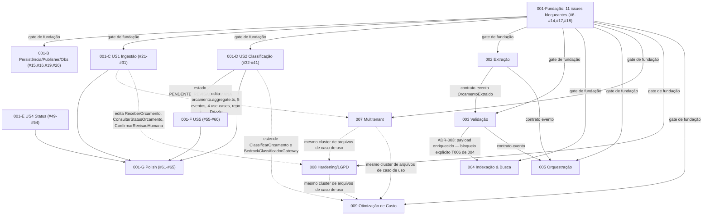

# Plano de Paralelismo de Execução — 362 issues abertas (`labsitio/nexus-orc-back`)

Base: inventário completo de `#6` a `#385` (362 issues abertas), `tasks.md`/`plan.md` das specs 001–005, 007–009. Repositório sem código-fonte hoje (só `docs/`, `specs/`, `prompts/`, `.specify/`, `.claude/`) — quase toda issue **cria** arquivo, o teto de paralelismo é colisão de arquivo-âncora, não volume de issues.

**Correção desta revisão**: `spec-001` deixa de ser tratada como bloco opaco. Suas 53 issues são classificadas issue-a-issue em fundação bloqueante vs. trabalho tardio paralelizável, com trilhas e ordem explícitas — igual às outras 7 specs. Dado verificado: as 53 issues de 001 estão hoje **todas atribuídas a um único assignee, `paulo-labsit`** — 001 é, na prática, uma fila serial de um executor, e é justamente a fundação da qual as outras 7 specs dependem. Ver seção "Realocação de spec-001".

## Resumo executivo

O repo suporta, de forma segura, **até 10 trilhas paralelas simultâneas na Onda 1** — 7 das specs 002–009 mais 3 trilhas internas de `spec-001` (US1, US2, US4) que rodam ao lado delas, não antes. O teto nunca é o volume de issues (362), é colisão de arquivo-âncora e a estreiteza real da fundação:

1. **Apenas 11 das 53 issues de 001 são fundação bloqueante de verdade** — `#6`–`#14`, `#17`, `#18` (monorepo, CI, estrutura de pastas, Drizzle Kit baseline, os 4 VOs+agregado+eventos+interfaces de Domain, bucket S3 `nexo-orcamentos-raw`, bus EventBridge `nexo-dominio-bus`). São essas que as outras specs citam explicitamente como pré-requisito ("monorepo já inicializado", "ADR-001 herdado", ler/escrever no mesmo bucket/bus). As **42 restantes** (`#15`,`#16`,`#19`,`#20`,`#21`–`#41`,`#49`–`#65`) não bloqueiam nenhuma outra spec — só o contrato de evento documentado (`OrcamentoClassificado`, `schemaVersion: 1`, fixado já em `#13`/T008) importa para 002/005; o *código* de US1/US2/US4/US5/Polish de 001 pode avançar em paralelo com 002–009.
2. **001 hoje é 1 trilha real (1 assignee, 53 issues em fila)**, mas suporta até **5 agentes simultâneos** se redistribuída: 2 na Fundação (curta, ~7 passos de caminho crítico) e até 3 nas trilhas tardias (US1, US2, US4 correm em paralelo per o próprio `tasks.md` de 001).
3. **007, 008 e 009 editam arquivos que a própria 001 está criando agora** — mesma restrição da revisão anterior, ainda válida e detalhada na seção "Serialização obrigatória".
4. **Arquivos compartilhados transversais** (`package.json`, journal de migração Drizzle Kit, stack IaC do bus único) continuam sendo pontos de serialização mesmo quando o código de domínio é logicamente independente.

## Estado atual

| Spec | Issues abertas | Label | Observação |
|---|---|---|---|
| 001 · Ingestão & Classificação | 53 | `in-progress` | **Assignee único (`paulo-labsit`) — hoje 1 trilha serial.** 11 issues são fundação bloqueante real; 42 são "001 tardio", paralelizável com as outras 7 specs. Ver classificação completa abaixo e seção "Realocação". |
| 005 · Orquestração & Integrações | 52 | `ready` | Depende do contrato de evento de 002 e 003. |
| 003 · Validação de Consistência | 51 | `ready` | Depende do contrato de evento de 002 (`OrcamentoExtraido`). |
| 008 · Hardening Segurança/LGPD | 47 | `ready` | Maior parte novo BC `platform/conformidade`; poucas edições em 001. |
| 004 · Indexação & Busca Semântica | 46 | `ready` | Bloqueio explícito de contrato (ADR-003) até 003 enriquecer payload. |
| 002 · Extração de Dados | 39 | `ready` | Depende do contrato de evento de 001 (`OrcamentoClassificado`, já fixado em `#13`). |
| 007 · Isolamento Multitenant | 38 | `ready` | Edita diretamente 5+ arquivos-âncora de 001. |
| 009 · Otimização de Custo | 36 | `ready` | Estende diretamente `ClassificarOrcamento`/`BedrockClassificadorGateway` de 001. |
| **Total** | **362** | | |

## Classificação das 53 issues de spec-001

### Fundação bloqueante real (11 issues — nenhuma outra spec pode ignorar)

Critério: é literalmente citada por outra spec ("monorepo já inicializado", "ADR-001 herdado", mesmo bucket S3, mesmo bus EventBridge) ou define o contrato de evento que 002/005 consomem.

| Issue | Task | O que entrega | Por que bloqueia outras specs |
|---|---|---|---|
| `#6` | T001 | Monorepo Node 24 + TS strict, `package.json`/`tsconfig.json` | Toda `T001` de 002–009 assume isso pronto |
| `#7` | T002 | ESLint/Prettier/Husky | Convenção de lint vinculante para o monorepo inteiro |
| `#8` | T003 | CI GitHub Actions | Todo PR de qualquer spec passa por esse pipeline |
| `#9` | T004 | Estrutura de pastas `ingestao-identificacao` | Pré-requisito interno para `#11`–`#14` existirem |
| `#10` | T005 | Drizzle Kit + baseline | "ADR-001 herdado" citado literalmente por 002 T002, 003 T002, 005 T002 |
| `#11` | T006 | VOs (`OrcamentoId`, `Canal`, `NivelConfianca`, etc.) | Contrato de tipo que 002 replica localmente |
| `#12` | T007 | Agregado `Orcamento` | Fixa a máquina de estado que 007/009 vão editar depois |
| `#13` | T008 | Os 4 Domain Events (`schemaVersion: 1`) | **Este é o contrato que 002 assina** (`OrcamentoClassificado`) e 005 também |
| `#14` | T009 | Interfaces de repositório/gateway | Molde que 007 estende (`DrizzleTenantScopedRepositoryBase`) |
| `#17` | T012 | Bucket S3 `nexo-orcamentos-raw` | 002 lê o mesmo bucket (`S3LeituraBrutaGateway`); 008/009 adicionam lifecycle rules a ele |
| `#18` | T013 | Bus EventBridge `nexo-dominio-bus` | Toda regra EventBridge de 002–009 aponta para este mesmo bus |

**Gate de saída da Fundação**: merge em `main` desses 11 issues — não das 53.

### "001 tardio" — paralelizável com as ondas de 002/003/004/005/007/008/009 (42 issues)

Nenhuma delas é citada como pré-requisito por outra spec. Cada uma só depende de outras issues **dentro** de 001.

| Trilha interna | Issues | Depende de (dentro de 001) | Pode rodar ao lado de |
|---|---|---|---|
| **001-B** Persistência+Publisher+Obs | `#15`,`#16` (T010,T011), `#19` (T014), `#20` (T015) | `#14` (repo interface), `#9` (pasta) | Onda 1 de 002–009, desde a Fundação mergeada |
| **001-C** US1 Ingestão | `#21`–`#31` (T016–T026) | `#16` (repo), `#17` (bucket) | 001-D (US2) e 001-E (US4) — arquivos diferentes, sem colisão de código; a única dependência real é o contrato de evento, já fixado em `#13` |
| **001-D** US2 Classificação | `#32`–`#41` (T027–T036) | `#12` (agregado), `#14` (interfaces) — **não** depende do código de US1, só do contrato | 001-C, 001-E |
| **001-E** US4 Status consultável | `#49`–`#54` (T044–T049) | `#16` (repo) — leitura apenas | 001-C, 001-D (o próprio `tasks.md` de 001 diz isso explicitamente: "US4 pode rodar em paralelo com US2") |
| **001-F** US5 Confirmação humana | `#55`–`#60` (T050–T055) | `#37` (T032, `ClassificarOrcamento`) — precisa que exista o estado `PENDENTE_REVISAO_HUMANA` | Nada — sequencial após 001-D |
| **001-G** Polish | `#61`–`#65` (T056–T060) | Tudo anterior (medição p95, revisão de segurança, validação de todas as IAM roles) | É cauda, não trilha paralela |

Nota sobre `#21`–`#41` (US1×US2): `tasks.md` de 001 declara a ordem "Setup → Foundational → US1 → US2 → ..." como sequencial, mas essa ordem é sobre **fluxo de evento/teste de integração**, não sobre colisão de arquivo — `receber-orcamento.ts` (US1) e `classificar-orcamento.ts` (US2) são arquivos diferentes. Tratado aqui como **suposição**: Domain/Application/Infra de US1 e US2 podem ser codados por agentes diferentes em paralelo; só o teste de integração end-to-end (`#23`/T018, `#34`/T029) exige que o outro lado já esteja rodando de verdade em LocalStack.

**Quantos agentes cabem em spec-001 hoje**: teto real de **5 agentes simultâneos** em momentos de pico — até 2 explorando o paralelismo interno da Fundação (caminho crítico curto: `#6`→`#9`→`#11`→`#12`, com `#7`,`#8`,`#10` e depois `#13`,`#14`,`#17`,`#18` preenchendo ao lado) e até 3 nas trilhas tardias 001-C/001-D/001-E rodando ao mesmo tempo. Uso atual: **1** (todas as 53 com `paulo-labsit`).

## Grafo de dependências entre specs

## Onda 0 · Fundação (11 issues, trilha curta, hoje com `paulo-labsit`)

Caminho crítico e paralelismo interno:

- Sequencial obrigatório: `#6` (T001) → `#9` (T004) → `#11` (T006) → `#12` (T007).
- Paralelo desde o início (não depende de nada de 001): `#7`,`#8`,`#10` (T002,T003,T005 — todas `[P]` no `tasks.md`).
- Paralelo assim que `#11` estiver pronto: `#13`,`#14` (T008,T009 — `[P]` entre si).
- Paralelo total, IaC pura, sem dependência de Domain: `#17`,`#18` (T012,T013 — `[P]` entre si).

Gate de saída: merge em `main` desses 11 (não das 53) antes de qualquer `T001` de 002–009 e antes de qualquer trilha tardia de 001 (B/C/D/E).

## Tabela de ondas

| Onda | Trilha | Spec | Issues (#) | Arquivos/módulos donos | Bloqueia | Bloqueado por |
|---|---|---|---|---|---|---|
| 0 | Única (2 agentes cabem) | 001-Fundação | `#6`–`#14`, `#17`, `#18` | monorepo raiz, `src/bounded-contexts/ingestao-identificacao/{domain}` (parcial), bucket S3, bus EventBridge | Todas as demais trilhas | — |
| 1 | 001-B | 001 | `#15`,`#16`,`#19`,`#20` | `infrastructure/persistence`, `infrastructure/aws` de 001 | 001-C (repo), 001-D (publisher, indireto) | Onda 0 |
| 1 | 001-C | 001 | `#21`–`#31` | `application/use-cases/receber-orcamento.ts`, `interface/http`, `interface/events` (US1) | 007 (E'), 008 (F') — edições futuras | Onda 0, 001-B (`#16`) |
| 1 | 001-D | 001 | `#32`–`#41` | `application/use-cases/classificar-orcamento.ts`, `infrastructure/bedrock`, `infrastructure/markitdown` (US2) | 009 (G') — edição futura; 001-F (US5) | Onda 0 |
| 1 | 001-E | 001 | `#49`–`#54` | `application/use-cases/consultar-status-orcamento.ts`, `interface/http` (US4) | 008 (F') — edição futura | Onda 0, 001-B (`#16`) |
| 1 | A | 002 | `#66`–`#110` | `src/bounded-contexts/extracao/**` | 003 (contrato), 005 (contrato) | Onda 0 |
| 1 | B | 003 | `#111`–`#160`, `#385` | `src/bounded-contexts/validacao/**` | 004 (ADR-003), 005 (contrato) | Onda 0, contrato de 002 |
| 1 | C | 004 (parcial) | `#161`–`#206` exceto `#166` | `src/bounded-contexts/busca-indexacao/**` | — | Onda 0; `#166` aguarda decisão de payload de 003 |
| 1 | D | 005 | `#207`–`#263` | `src/bounded-contexts/orquestracao/**` | — | Onda 0; contratos de 002/003 |
| 1 | E | 007 (parcial) | `#264`–`#276`, `#282`–`#301` | `src/shared-kernel/tenant/**`, `src/bounded-contexts/acompanhamento/**` | Onda 2 (E') | Onda 0 |
| 1 | F | 008 (parcial) | `#302`–`#321`, `#323`–`#326`, `#328`–`#333`, `#335`–`#348` | `src/platform/conformidade/**`, `infra/` (contas AWS) | Onda 2 (F') | Onda 0 |
| 1 | G | 009 (parcial) | `#349`–`#358`, `#367`–`#380`, `#382`–`#384` | `infra/dynamodb/**`, `infra/s3/**` | Onda 2 (G') | Onda 0 |
| 2 | 001-F | 001 | `#55`–`#60` | `application/use-cases/confirmar-revisao-humana.ts` (US5) | — | 001-D completo |
| 2 | E' | 007 | `#277`–`#281`, `#297` | edita `orcamento.aggregate.ts`, eventos, casos de uso, repo Drizzle de 001 | — | Merge completo de 001 (todas as 53) |
| 2 | F' | 008 | `#322`, `#327`, `#334`, `#339`, `#342`, `#343` | edita `receber-orcamento.ts`, `consultar-status-orcamento.ts`, `confirmar-revisao-humana.ts` | — | Merge completo de 001; ordem após E' |
| 2 | G' | 009 | `#359`, `#364`, `#365`, `#366`, `#381` | edita `classificar-orcamento.ts`, `bedrock-classificador.gateway.ts`, IAM `ClassificadorLambdaRole` | — | Merge completo de 001; ordem após E'/F' |
| 2/3 | 001-G | 001 | `#61`–`#65` | documentação, medição, revisão de segurança de 001 | — | Todo o restante de 001 |
| 3 | Sync | 004↔003, 005↔002/003, 007↔002-005, 008↔002-007 | `#166`, `#160`, `#262`, `#295`, `#296`, `#346` | `spec.md`/`plan.md` de várias specs | — | Onda 1/2 substancialmente concluídas |

**Máximo de trilhas paralelas por onda: 10** (Onda 1 — as 7 trilhas de 002/003/004-parcial/005/007-parcial/008-parcial/009-parcial mais as 3 trilhas tardias de 001: 001-B/001-C/001-D, com 001-E encaixando como uma 4ª se houver agente disponível, e 001-F/001-G como continuações sequenciais, não slots adicionais).

## Trilhas paralelas por onda

### Onda 0 (2 agentes, curta)

**Trilha 001-Fundação** — ordem: `#6` → (paralelo: `#7`,`#8`,`#10`) → `#9` → `#11` → `#12` → (paralelo: `#13`,`#14`) → (paralelo, independente: `#17`,`#18`).
Exclusividade: raiz do monorepo, `src/bounded-contexts/ingestao-identificacao/domain/**`, bucket/bus provisionados.

### Onda 1 (até 10 trilhas simultâneas)

**Trilha 001-B — Persistência/Publisher/Obs**
Ordem: `#15` (schema `orcamentos`) → `#16` (repo, precisa `#14`) → `#19` (`EventBridgePublisher`, precisa `#14`) → `#20` (pino+OTel, independente, pode ser a primeira das 4 na prática).

**Trilha 001-C — US1 Ingestão**
Ordem: `#21`,`#22`,`#23` (testes, `[P]`) → `#24` (`S3ArmazenamentoBrutoGateway`) → `#25` (`ReceberOrcamento`, precisa `#16`/001-B) → `#26`,`#27` (controllers, paralelo) → `#28` (trigger SFTP, paralelo) → `#29` (lifecycle rule, paralelo) → `#30` (auth Cognito) → `#31` (IAM).
Exclusividade: `application/use-cases/receber-orcamento.ts`, `interface/http/upload-url.*`, `interface/http/confirmar-upload.*`, `interface/events/sftp-trigger.*`.

**Trilha 001-D — US2 Classificação**
Ordem: `#32`,`#33`,`#34` (testes, `[P]`) → `#35` (MarkItDown ACL) `‖` `#36` (Bedrock gateway) → `#37` (`ClassificarOrcamento`) → `#38` (fila SQS, pode ser antes, IaC independente) → `#39` (handler) → `#40`,`#41` (IAM, observabilidade, paralelo).
Exclusividade: `application/use-cases/classificar-orcamento.ts`, `infrastructure/bedrock/**`, `infrastructure/markitdown/**`.
Roda ao lado de 001-C (arquivos diferentes) — só precisa do contrato de evento já fixado em `#13`, não do código de US1.

**Trilha 001-E — US4 Status consultável**
Ordem: `#49`,`#50` (testes, `[P]`) → `#51` (`ConsultarStatusOrcamento`) → `#52`,`#53` (controller, IAM, paralelo) → `#54` (métrica).
Exclusividade: `application/use-cases/consultar-status-orcamento.ts`, `interface/http/status.*`.
Confirmado pelo próprio `tasks.md` de 001: roda em paralelo a 001-D.

**Trilha A — Extração (002)** … **Trilha G — Otimização de Custo (009, parcial)**: inalteradas da revisão anterior — ver detalhamento de ordem por issue já validado (Domain→Infra→testes→Bedrock/embedding→segurança/métricas), exclusividade de pasta por Bounded Context.

### Onda 2 (sequencial — colisão de arquivo real, mais 001-F)

1. **001-F** `#55`,`#56` (testes) → `#57` (`ConfirmarRevisaoHumana`) → `#58`,`#59` (controller, IAM) → `#60` (publica `OrcamentoReclassificadoPorRevisaoHumana`). Só pode abrir depois de 001-D completo (precisa do estado `PENDENTE_REVISAO_HUMANA` produzido por `#37`).
2. **E'** `#277`→`#278`→`#279`→`#280`→`#281`→`#297` (inalterado da revisão anterior).
3. **F'** `#343`→`#334`→(`#327`,`#322`,`#339`,`#342` em paralelo) (inalterado).
4. **G'** `#359`→`#365`→`#364`→`#366`→`#381` (inalterado).

### Onda 2/3 (cauda)

**001-G Polish**: `#61`,`#62` (`[P]`, podem começar bem antes — OpenAPI e `npm audit` não dependem de nada além do código já existir) → `#63`,`#64`,`#65` (medição p95, revisão de segurança, validação de todas as IAM roles — precisam de 001-C, 001-D, 001-F completas).

## Realocação de spec-001

001 está hoje com 53 issues em um único assignee (`paulo-labsit`), o que serializa a fundação e trava as outras 7 specs até ela terminar por completo (Onda 2 de 007/008/009 exige merge 100%). Proposta concreta de desmembramento, respeitando o protocolo `claim-issue` (reassign exige liberar o claim antes — nunca dois donos simultâneos):

| Quem | Issues propostas | Total | Ação |
|---|---|---|---|
| **`paulo-labsit` (mantém)** | `#6`,`#7`,`#8`,`#9`,`#10`,`#11`,`#12`,`#13`,`#14`,`#17`,`#18` | 11 | Nenhuma ação — é a Fundação, caminho crítico, trocar de dono no meio custa mais do que economiza. |
| **Agente dev-back-end B (novo)** | `#15`,`#16`,`#19`,`#20`,`#21`,`#22`,`#23`,`#24`,`#25`,`#26`,`#27`,`#28`,`#29`,`#30`,`#31` | 15 | `paulo-labsit` libera o claim dessas 15 (estão hoje reservadas mas fora do caminho crítico); Agente B reivindica via `claim-issue` assim que a Fundação (11 issues) mergear. |
| **Agente dev-back-end C (novo)** | `#32`,`#33`,`#34`,`#35`,`#36`,`#37`,`#38`,`#39`,`#40`,`#41`,`#55`,`#56`,`#57`,`#58`,`#59`,`#60` | 16 | Libera+reivindica igual a B. Ganha também US5 (`#55`–`#60`) para evitar handoff — mesmo agente que fez `ClassificarOrcamento` implementa a confirmação humana que depende dela. |
| **Agente dev-back-end D (novo)** | `#49`,`#50`,`#51`,`#52`,`#53`,`#54` | 6 | Libera+reivindica. Roda ao lado de B e C (US4 é leitura, sem colisão de arquivo com US1/US2). |
| **Sem dono fixo (fechamento)** | `#61`,`#62`,`#63`,`#64`,`#65` | 5 | Quem terminar primeiro entre B/C/D reivindica via `claim-issue`; `#61`,`#62` podem ser adiantadas por qualquer um antes disso (não dependem de US4/US5). |

Soma de verificação: 11 + 15 + 16 + 6 + 5 = 53.

Sequência de liberação recomendada: `paulo-labsit` (ou quem administra o board) faz o unclaim das 42 issues tardias **antes** de anunciar as trilhas B/C/D — evita corrida entre `claim-issue` de agentes diferentes tentando pegar a mesma issue ainda marcada como reservada por outra pessoa.

## Serialização obrigatória

| Issue(s) | Arquivo/recurso em lock | Justificativa |
|---|---|---|
| `#6` (001 T001) | `package.json`, `tsconfig.json` | Todo o resto do repo depende de existir antes de qualquer outra `T001`. |
| `#9`→`#11`→`#12` (001, dentro da Fundação) | pasta → VOs → agregado | Cadeia sequencial interna à Fundação — sem isso paralelo real na Onda 0 fica em 3 dos 11 issues, o resto (`#7`,`#8`,`#10`,`#13`,`#14`,`#17`,`#18`) preenche ao lado. |
| `#37` (001-D, T032) → `#55`–`#60` (001-F) | estado `PENDENTE_REVISAO_HUMANA` do agregado `Orcamento` | US5 não existe sem US2 já produzir o estado que ela confirma — dependência de dado, não de arquivo, mas igualmente bloqueante. |
| `#350` (009 T002) | `package.json` | Única issue fora de 001 que edita `package.json` — mergear isolada, sem PR concorrente tocando o arquivo. |
| Migrações Drizzle Kit (T00x de cada spec/trilha: `#10`,`#15`,`#67`,`#112`,`#162`-`#163`,`#208`,`#303`) | `drizzle/meta/_journal.json` | Drizzle Kit numera migrações sequencialmente; gerar duas migrações em branches paralelas e mergear fora de ordem corrompe o journal — cada `pnpm drizzle-kit generate` deve rodar contra `main` atualizado, uma PR de schema por vez. |
| `#277`→`#278`→`#279`→`#280`→`#281` (007) | `orcamento.aggregate.ts`, eventos, 4 casos de uso, repositório de 001 | Edição direta e sequencial dos mesmos arquivos; ordem importa (agregado antes de eventos antes de casos de uso antes de repositório). Pré-requisito: merge de todas as 53 de 001, incluindo `#55`–`#65`. |
| `#280` (007 T017) × `#334` (008 T033) × `#364` (009 T016) | `classificar-orcamento.ts` / `confirmar-revisao-humana.ts` / `consultar-status-orcamento.ts` | Três specs diferentes editam o mesmo cluster de casos de uso — única trilha, ordem 007→008→009. |
| `#278` (007 T015) × `#355` (009 T007) | tipo de envelope de Domain Event / arquivos de evento | Ambas adicionam campo ao envelope (`tenantId` obrigatório vs. `prioridade` opcional) — confirmar se é o mesmo arquivo de tipo base antes de paralelizar; se sim, 007 primeiro (breaking, bump de `schemaVersion`), 009 rebaseia depois (aditivo). |
| `#295` (007 T032) × `#381` (009 T033) | `specs/001-.../plan.md` | Ambas anexam nota de amendment ao mesmo arquivo de documentação — mesclar como PRs sequenciais pequenas. |
| Regras EventBridge no bus único `nexo-dominio-bus` (uma por spec: `#69`,`#114`,`#165`,`#210`-`#212`,`#288`) | Stack/arquivo IaC do bus (não nomeado nas specs — ver Suposições) | Se a IaC for um único stack CDK/Terraform, cada regra nova é uma edição no mesmo arquivo de stack — tratar como fila de merge. |

## Regras operacionais para os agentes dev

1. **Reserva via `claim-issue`**: todo agente `dev-back-end` chama a skill `claim-issue` antes de tocar qualquer issue — inclusive nas trilhas internas de 001 (B/C/D acima), depois do unclaim das issues tardias por `paulo-labsit`.
2. **Branch/worktree por trilha**, não por issue: `feat/001-b-persistencia`, `feat/001-c-us1`, `feat/001-d-us2`, `feat/002-extracao`, etc.
3. **Ordem de PR/merge**: sequencial só quando duas PRs tocam arquivo compartilhado (ver Serialização); entre trilhas sem overlap (ex.: 001-C vs. 001-D, ou 002 vs. 003), merge pode ser concorrente.
4. **Migrations Drizzle**: gerar a migração só depois de puxar `main` atualizado; nunca duas migrações pendentes de merge ao mesmo tempo.
5. **IaC**: uma issue por PR, nome de recurso sempre o do `plan.md`; se stack compartilhada, tratar como merge sequencial mesmo entre trilhas "independentes".
6. **Onda 2 (E'/F'/G'/001-F)**: só abrir depois do gate correspondente — 001-F depois de 001-D; E'/F'/G' depois de **todas** as 53 issues de 001 mergeadas (não só a Fundação).

## Riscos e pontos de re-sincronização

- **Re-sync 1** (fim da Trilha B, spec 003): decisão de payload enriquecido de `OrcamentoValidado` — trava `#166` (004 T006).
- **Re-sync 2** (fim de 001-C/001-D/001-E, antes de 001-F e antes da Onda 2 de 007/008/009): confirmar merge 100% de `spec-001` — gate manual.
- **Re-sync 3** (`#297`, 007 T034): decisão dual v1/v2 de schema de evento se já houver tenant real em produção.
- **Re-sync 4** (`#262`, `#296`, `#346`): edições cruzadas de `spec.md`/`plan.md` de outras specs — checkpoint de fechamento, não trabalho de trilha.
- **Risco novo desta revisão**: tratar US1×US2 de 001 (001-C/001-D) como paralelizáveis é uma leitura do `tasks.md` (ordem serial declarada é sobre fluxo de evento/teste de integração, não sobre arquivo) — se o time de 001 preferir seguir a ordem literal do `tasks.md`, 001-D só abre depois de 001-C completo, e o teto de paralelismo da Onda 1 cai de 10 para 9 trilhas (perde-se a simultaneidade 001-C‖001-D, mas 001-E ainda cabe ao lado de qualquer uma das duas).

## Suposições

- **IaC (CDK/Terraform) não tem stack nomeada nas specs** — mesma suposição da revisão anterior, mantida.
- **`#385` é duplicata de `#133`** — mantida.
- **Gate "merge completo de `spec-001`" para Onda 2 (E'/F'/G')** exige as 53 issues, não só as 11 de Fundação — mantido conservador porque 007/008/009 editam arquivos criados ao longo de todo o backlog de 001 (`#277`–`#281` tocam arquivos de US1/US2, não só de Fundação).
- **US1 e US2 de 001 (001-C/001-D) são paralelizáveis por código**, apesar da ordem serial declarada em "Dependencies & Execution Order" do `tasks.md` de 001 — ver "Riscos" acima; não há evidência definitiva de colisão de arquivo entre elas, mas também não há confirmação explícita do time de que a ordem serial é só sobre teste de integração.
- **Envelope de Domain Event compartilhado entre `#278` (007) e `#355` (009)** — mantida como risco a confirmar.
